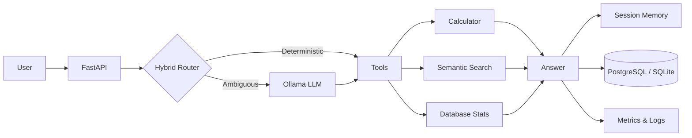
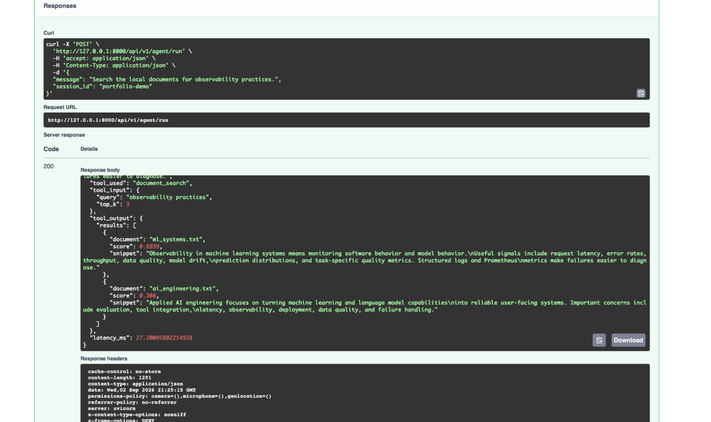
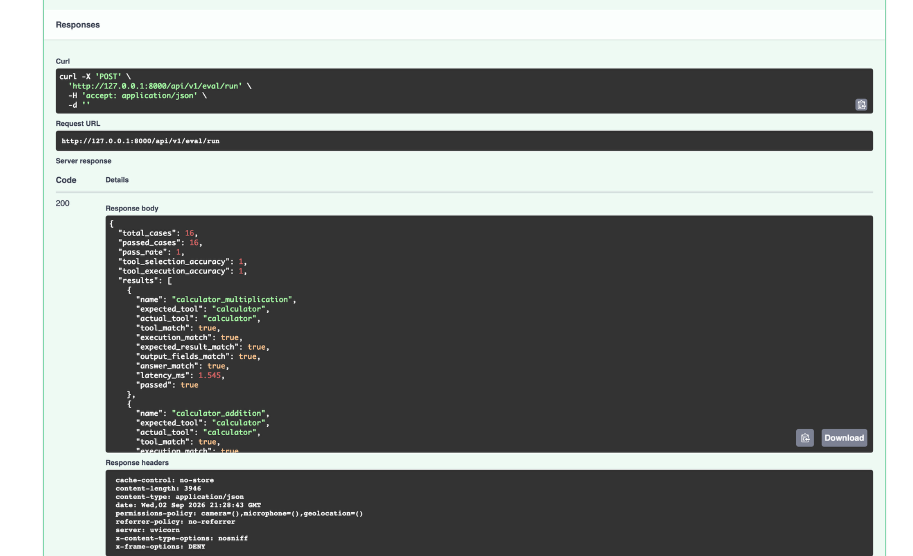
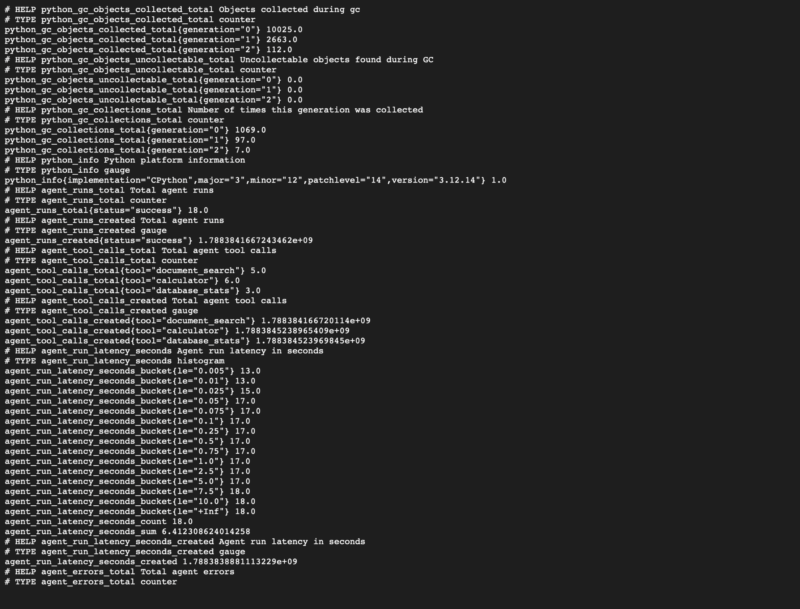

# # Applied AI Agent Platform

Production-style **AI agent backend** demonstrating how LLMs, deterministic routing, semantic retrieval, tool execution, evaluation, and observability can be combined into a testable and deployable AI system.

Built with **Python, FastAPI, Ollama, Sentence Transformers, PostgreSQL, Docker, Kubernetes, Prometheus, pytest, and GitHub Actions**.

---

## What It Does

The platform receives a user request and decides how it should be handled:

- **Deterministic routing** for requests that can be resolved without an LLM
- **Local LLM fallback** with Ollama / Llama 3.2 3B for ambiguous or generative requests
- **Semantic document retrieval** using Sentence Transformer embeddings
- **Safe tool execution** for calculations and database statistics
- **Session memory** for context-aware follow-up questions
- **Persistent execution history** with SQLAlchemy and PostgreSQL / SQLite
- **Prometheus metrics and structured logging** for runtime observability

The goal is to treat an AI agent as a **measurable software system**, rather than just a chatbot.

---

## Architecture



---

## Demo

### Agent Execution

The agent automatically selects `document_search`, retrieves ranked local documents, and returns the result through the API.



### Evaluation

A deterministic evaluation suite validates routing and tool execution independently of LLM-output variability.

**16/16 evaluation cases passed**

- 100% tool-selection accuracy
- 100% tool-execution accuracy
- 100% answer-validity accuracy
- 100% expected-result accuracy
- 100% output-schema accuracy



### Observability

Prometheus metrics expose agent runs, tool usage, execution latency, and errors.



---

## Engineering Highlights

### Hybrid Agent Routing

Simple requests bypass the LLM and execute through deterministic fast paths. Ollama is used only when the request requires LLM-based planning or generation.

This reduces unnecessary model calls, latency, compute usage, and non-deterministic behavior.

### Semantic Retrieval

Local documents are embedded using **Sentence Transformers (`all-MiniLM-L6-v2`)** and ranked using semantic similarity.

Document embeddings are cached rather than recomputed for every request.

Latest local 10-query benchmark:

| Metric | Result |
|---|---:|
| Median warm retrieval latency | **8.1 ms** |
| Average warm retrieval latency | 70.3 ms |
| Cold start | 7.0 s |

Results are hardware-dependent.

### Safe Tool Execution

The calculator uses a restricted Python AST evaluator instead of direct `eval()`, preventing arbitrary code execution.

### Evaluation & Testing

The project includes:

- **16/16 passing deterministic agent evaluation cases**
- **27 passing automated tests**
- Ruff linting
- GitHub Actions CI

Tests cover routing, tool execution, semantic retrieval, API endpoints, persistence, sessions, memory, and evaluation logic.

---

## Observability & Deployment

The application exposes Prometheus-compatible metrics including:

```text
agent_runs_total
agent_tool_calls_total
agent_run_latency_seconds
agent_errors_total
```

Execution latency is instrumented separately for:

```text
planning_ms
tool_ms
answer_generation_ms
total_ms
```

Deployment support includes:

- Docker
- Docker Compose
- Kubernetes manifests
- Liveness and readiness probes
- PostgreSQL
- GitHub Actions CI

---

## Tech Stack

| Area | Technology |
|---|---|
| Language | Python |
| API | FastAPI |
| Local LLM | Ollama / Llama 3.2 3B |
| Embeddings | Sentence Transformers |
| Persistence | SQLAlchemy |
| Databases | PostgreSQL / SQLite |
| Metrics | Prometheus |
| Testing | pytest |
| Linting | Ruff |
| Containers | Docker / Docker Compose |
| Orchestration | Kubernetes |
| CI | GitHub Actions |

---

## Run Locally

```bash
pip install -r requirements.txt
ollama pull llama3.2:3b
uvicorn src.api.main:app --reload
```

Swagger documentation:

```text
http://127.0.0.1:8000/docs
```

Prometheus metrics:

```text
http://127.0.0.1:8000/metrics
```

Run tests:

```bash
pytest -q
```

---

## Key Results

**16/16 evaluation cases passed · 27 automated tests passed · 8.1 ms median warm semantic retrieval latency**

This project demonstrates **Applied AI Engineering, LLM orchestration, semantic retrieval, tool calling, evaluation, backend engineering, observability, testing, containerization, and Kubernetes deployment**.

---

## License

MIT
