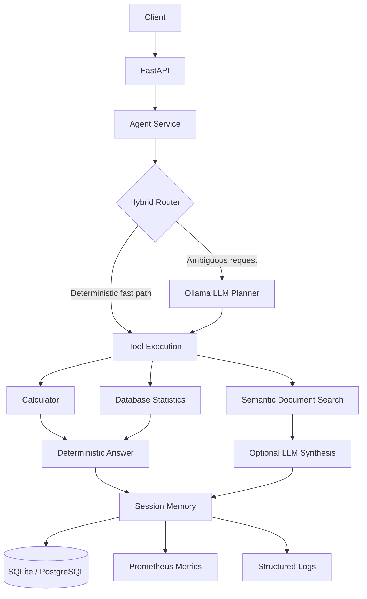

# Applied AI Agent Platform

A production-style **local AI agent backend** built with FastAPI, Ollama, semantic retrieval, tool execution, conversational memory, evaluation, observability, Docker, Kubernetes, pytest, Ruff, and GitHub Actions.

The project demonstrates applied AI engineering beyond a simple chatbot by combining **deterministic routing, local LLM inference, semantic document search, safe tool execution, measurable evaluation, persistence, metrics, structured logging, performance optimization, containerization, and orchestration**.

---

## Highlights

* Hybrid deterministic + LLM routing
* Local inference with Ollama and Llama 3.2 3B
* Semantic document retrieval with Sentence Transformers
* Cached document embeddings
* Safe AST-based calculator
* Database statistics tool
* Session-based conversational memory
* Context-aware follow-up handling
* Deterministic fallback when Ollama is unavailable
* SQLAlchemy persistence
* SQLite and PostgreSQL support
* Prometheus-compatible metrics
* Structured logging
* Per-stage latency instrumentation
* Reproducible agent evaluation
* Docker / Docker Compose
* Kubernetes deployment manifests
* Liveness and readiness probes
* pytest + Ruff
* GitHub Actions CI

---

## Architecture



### Deployment architecture

```mermaid
flowchart TD
    C[Client] --> S[Kubernetes Service]
    S --> D[Deployment]
    D --> P[FastAPI Pod]

    P --> H[/health]
    P --> R[/ready]
    P --> A[Agent Service]

    A --> T[Tools]
    A --> DB[(Database)]
    A --> O[Ollama]
    A --> M[Prometheus Metrics]
```

---

## Why This Project

This is not just a chatbot.

The platform is designed as an **AI-enabled software system** that can:

* route requests to specialized tools
* bypass the LLM when deterministic logic is sufficient
* execute tools safely
* search local documents semantically
* synthesize retrieval results with a local LLM
* preserve short-term conversational context
* resolve references across conversation turns
* persist execution history
* expose operational metrics
* measure latency by execution stage
* evaluate tool selection and execution
* operate without a paid cloud LLM API
* run as a containerized application
* deploy to Kubernetes

The focus is on **reliability, observability, testability, reproducibility, and explicit engineering trade-offs**.

---

# Agent Design

## Hybrid Routing

The agent combines:

```text
deterministic routing
+
LLM fallback
```

Simple requests are routed without invoking the model.

Example:

```text
What is 17.5 multiplied by 8?
```

routes directly to:

```text
calculator
```

Similarly:

```text
Show me the database stats for previous runs.
```

routes directly to:

```text
database_stats
```

The LLM planner is used only when deterministic routing cannot confidently resolve the request.

This reduces:

* model calls
* latency
* compute usage
* non-deterministic behavior

---

## Local LLM Integration

The platform integrates with **Ollama** for local inference.

Default model:

```text
llama3.2:3b
```

The model is used for:

* ambiguous routing
* document-result synthesis
* conversational reasoning
* context-aware follow-up responses

No paid cloud LLM API is required.

---

## Semantic Document Retrieval

The document-search tool uses dense vector embeddings rather than basic keyword matching.

Embedding model:

```text
all-MiniLM-L6-v2
```

Retrieval flow:

```text
documents
   ↓
Sentence Transformer
   ↓
document embeddings
   ↓
embedding cache
   ↓
query embedding
   ↓
cosine similarity
   ↓
ranked results
```

Example request:

```json
{
  "message": "Find documents about monitoring model behavior."
}
```

Example result:

```json
{
  "document": "ml_systems.txt",
  "score": 0.4551,
  "snippet": "..."
}
```

---

## Embedding Cache

Document embeddings are generated once and cached.

Without caching:

```text
request
→ load documents
→ embed all documents
→ embed query
→ similarity search
```

With caching:

```text
startup
→ load documents
→ embed documents once
→ cache vectors

request
→ embed query
→ similarity search
```

This significantly reduces warm retrieval latency.

---

# Performance

## Retrieval Benchmark

Benchmark implementation:

```text
src/eval/retrieval_benchmark.py
```

Latest local result:

```text
queries_tested: 10

cold_start_ms:
13788.895

warm_latency_ms:
  average: 12.377
  median: 13.038
  p95: 13.566
  min: 10.030
  max: 13.655
```

The cold measurement includes one-time model initialization and corpus embedding in a fresh Python process.

Warm requests reuse:

* the initialized embedding model
* cached document embeddings

Results are hardware-dependent.

Machine-readable output:

```text
artifacts/retrieval_benchmark.json
```

---

## Per-Stage Latency

Agent execution is instrumented separately for:

```text
planning_ms
tool_ms
answer_generation_ms
total_ms
```

Example:

```text
planning_ms:            0.15
tool_ms:               46.38
answer_generation_ms: 26244.83
total_ms:              26291.93
```

This makes performance bottlenecks directly observable.

---

## Fast-Path Optimization

An earlier implementation used the LLM for both planning and final answer generation.

Observed example:

```text
planning_ms:          ~22782
tool_ms:                ~425
answer_generation_ms: ~15867
total_ms:             ~39076
```

After deterministic fast-path routing:

```text
planning_ms:             ~0.15
tool_ms:                ~46
answer_generation_ms: ~26245
total_ms:             ~26292
```

For tools whose result can be formatted deterministically, the final LLM call is removed entirely.

Calculator example:

```text
planning_ms:          ~0.23
tool_ms:              ~0.04
answer_generation_ms: 0
total_ms:             ~0.34
```

Database statistics example:

```text
planning_ms:          ~0.01
tool_ms:               ~5.2
answer_generation_ms: 0
total_ms:             ~5.26
```

---

# Tools

## Safe Calculator

Arithmetic expressions are evaluated using a restricted Python AST.

Supported operations include:

* addition
* subtraction
* multiplication
* division
* powers
* modulo
* unary positive values
* unary negative values

The implementation intentionally avoids unsafe direct evaluation with `eval()`.

Example:

```json
{
  "message": "What is 17.5 multiplied by 8?"
}
```

Result:

```json
{
  "tool_used": "calculator",
  "tool_output": {
    "result": 140.0
  }
}
```

---

## Database Statistics

The agent can inspect aggregate statistics from previous executions.

Example:

```json
{
  "message": "Show me the database stats for previous runs."
}
```

Example result:

```json
{
  "total_runs": 10,
  "tool_runs": 8,
  "direct_runs": 2
}
```

---

# Conversation Memory

The platform provides short-term session-based memory.

Each request may contain:

```text
session_id
```

If no session ID is provided, one is generated automatically.

Example first request:

```json
{
  "message": "Find documents about monitoring model behavior."
}
```

Example response field:

```json
{
  "session_id": "6e5d01cd-f82f-4e71-b3db-b90740bfd6c8"
}
```

The same session can then be reused:

```json
{
  "message": "Summarize the first result.",
  "session_id": "6e5d01cd-f82f-4e71-b3db-b90740bfd6c8"
}
```

The agent can resolve references such as:

```text
the first result
that result
that document
the previous result
it
```

using stored conversational context.

---

## Bounded Memory

Conversation memory is deliberately bounded.

The local session store limits:

* stored turns per session
* active session count

This prevents uncontrolled context growth and excessive memory consumption.

The current implementation is intentionally process-local.

---

## Session Reset

A session can be cleared using:

```text
DELETE /api/v1/sessions/{session_id}
```

Example:

```json
{
  "session_id": "example-session-id",
  "cleared": true
}
```

---

# Evaluation

The platform includes a reproducible agent evaluation framework.

Run through:

```text
POST /api/v1/eval/run
```

Evaluation measures include:

* pass rate
* tool-selection accuracy
* tool-execution accuracy
* answer validity
* expected-result accuracy
* output-schema accuracy
* execution latency

Latest deterministic evaluation:

```text
total_cases:              16
passed_cases:             16
pass_rate:                1.0
tool_selection_accuracy:  1.0
tool_execution_accuracy:  1.0
answer_validity_accuracy: 1.0
expected_result_accuracy: 1.0
output_schema_accuracy:   1.0
```

Deterministic mode uses:

```text
ENABLE_LLM=false
```

to remove LLM-output variability and evaluate orchestration reproducibly.

Machine-readable results:

```text
artifacts/agent_eval_results.json
```

---

# Automated Tests

The test suite covers:

* health endpoint
* readiness endpoint
* calculator flow
* semantic retrieval
* database statistics
* run history
* session creation
* session preservation
* session memory
* session deletion
* unknown-session deletion
* conversational follow-up behavior
* individual tools
* evaluation logic
* memory-based follow-ups using monkeypatching

Current result:

```text
27 passed
```

Run:

```powershell
pytest -q
```

---

## Linting

The project uses Ruff.

Run:

```powershell
ruff check .
```

Automatic fixes:

```powershell
ruff check . --fix
```

Current status:

```text
All checks passed!
```

---

# API

## Health

```text
GET /health
```

Example:

```json
{
  "status": "ok"
}
```

## Readiness

```text
GET /ready
```

Example:

```json
{
  "status": "ready"
}
```

## Run Agent

```text
POST /api/v1/agent/run
```

Example:

```json
{
  "message": "Find documents about monitoring model behavior."
}
```

Session-aware request:

```json
{
  "message": "Summarize the first result.",
  "session_id": "example-session-id"
}
```

Example response structure:

```json
{
  "run_id": "uuid",
  "session_id": "uuid",
  "answer": "string",
  "tool_used": "document_search",
  "tool_input": {},
  "tool_output": {},
  "latency_ms": 1000
}
```

## List Runs

```text
GET /api/v1/agent/runs
```

Optional limit:

```text
GET /api/v1/agent/runs?limit=50
```

## Get Run

```text
GET /api/v1/agent/runs/{run_id}
```

## Clear Session

```text
DELETE /api/v1/sessions/{session_id}
```

## Run Evaluation

```text
POST /api/v1/eval/run
```

## Metrics

```text
GET /metrics
```

Interactive API documentation is available through FastAPI Swagger.

---

# Observability

The platform exposes Prometheus-compatible metrics.

Examples:

```text
agent_runs_total
agent_tool_calls_total
agent_run_latency_seconds
agent_errors_total
```

Observed application metrics from a live Docker Compose workload:

```text
agent_runs_total{status="success"} 5.0

agent_tool_calls_total{tool="calculator"} 2.0
agent_tool_calls_total{tool="document_search"} 2.0
agent_tool_calls_total{tool="database_stats"} 1.0

agent_run_latency_seconds_count 5.0
agent_run_latency_seconds_sum 163.01753908199998
```

This snapshot validates instrumentation rather than representing a throughput benchmark.

The application also emits structured execution logs.

Relevant fields include:

```text
run_id
tool_used
planning_ms
tool_ms
answer_generation_ms
total_ms
```

---

# Persistence

Agent executions are persisted with SQLAlchemy.

Stored information includes:

* run ID
* input message
* generated answer
* selected tool
* tool input
* tool output
* execution latency
* execution status
* creation timestamp

SQLite is supported for lightweight local development.

PostgreSQL is supported for production-style deployments.

---

# Security and Hardening

The project avoids arbitrary user-code execution.

The calculator uses a restricted AST evaluator instead of direct `eval()` execution.

Local and sensitive files are excluded from Git, including:

```text
.env
.venv/
__pycache__/
.pytest_cache/
.ruff_cache/
local database files
```

Docker build context is controlled using `.dockerignore`.

No paid API key is required by the default local LLM configuration.

Additional API hardening includes:

* sanitized client-facing error messages
* `503` handling for database/readiness failures
* 64 KiB request-size limit
* in-memory rate limiting at 60 requests per 60 seconds per client IP
* `X-Content-Type-Options: nosniff`
* `X-Frame-Options: DENY`
* `Referrer-Policy: no-referrer`
* restrictive `Permissions-Policy`
* `Cache-Control: no-store`
* PostgreSQL credentials supplied through environment configuration

The current rate limiter is suitable for local or single-instance demonstration deployments. A distributed deployment should use shared infrastructure such as an API gateway, ingress controller, or distributed store.

---

# Technology Stack

| Area                      | Technology            |
| ------------------------- | --------------------- |
| Language                  | Python                |
| API                       | FastAPI               |
| Validation                | Pydantic              |
| Persistence               | SQLAlchemy            |
| Server                    | Uvicorn               |
| Local LLM                 | Ollama                |
| Model                     | Llama 3.2 3B          |
| Embeddings                | Sentence Transformers |
| Embedding model           | all-MiniLM-L6-v2      |
| ML runtime                | PyTorch               |
| Local database            | SQLite                |
| Production-style database | PostgreSQL            |
| Metrics                   | Prometheus            |
| Logging                   | Structured logging    |
| Testing                   | pytest                |
| Linting                   | Ruff                  |
| Containers                | Docker                |
| Local orchestration       | Docker Compose        |
| Cluster orchestration     | Kubernetes            |
| CI                        | GitHub Actions        |

---

# Project Structure

```text
applied-ai-agent-platform/
│
├── .github/
│   └── workflows/
│       └── ci.yml
│
├── artifacts/
│   ├── agent_eval_results.json
│   └── retrieval_benchmark.json
│
├── data/
│   ├── documents/
│   └── eval/
│       └── agent_eval.json
│
├── src/
│   ├── agent/
│   │   ├── memory.py
│   │   ├── planner.py
│   │   ├── service.py
│   │   └── tools.py
│   │
│   ├── api/
│   │   └── main.py
│   │
│   ├── core/
│   │   ├── config.py
│   │   ├── logging.py
│   │   └── metrics.py
│   │
│   ├── db/
│   │   ├── base.py
│   │   └── session.py
│   │
│   ├── eval/
│   │   ├── retrieval_benchmark.py
│   │   └── runner.py
│   │
│   ├── models/
│   │   └── run.py
│   │
│   └── schemas/
│       └── agent.py
│
├── k8s/
│   ├── configmap.yaml
│   ├── deployment.yaml
│   ├── ingress.yaml
│   └── service.yaml
│
├── tests/
│
├── .dockerignore
├── .env.example
├── .gitignore
├── docker-compose.yml
├── Dockerfile
├── LICENSE
├── pyproject.toml
├── README.md
└── requirements.txt
```

---

# Local Setup

## 1. Create a Virtual Environment

Windows:

```powershell
python -m venv .venv
.\.venv\Scripts\Activate.ps1
```

## 2. Install Dependencies

```powershell
pip install -r requirements.txt
```

## 3. Configure Environment

Copy:

```text
.env.example
```

to:

```text
.env
```

The real `.env` file is ignored by Git.

---

# Ollama Setup

Install Ollama separately.

Verify:

```powershell
ollama --version
```

Pull the default model:

```powershell
ollama pull llama3.2:3b
```

Test:

```powershell
ollama run llama3.2:3b
```

---

# Run the API

```powershell
uvicorn src.api.main:app --reload
```

API:

```text
http://127.0.0.1:8000
```

Swagger:

```text
http://127.0.0.1:8000/docs
```

Prometheus metrics:

```text
http://127.0.0.1:8000/metrics
```

---

# Docker

Docker Compose can start the FastAPI application and PostgreSQL.

Ollama is expected to run on the host because local model and GPU environments vary.

Windows PowerShell:

```powershell
$env:POSTGRES_PASSWORD="postgres"
docker compose up --build
```

Build the application image directly:

```powershell
docker build -t applied-ai-agent-platform:latest .
```

---

# Kubernetes

The repository includes:

```text
k8s/
├── configmap.yaml
├── deployment.yaml
├── service.yaml
└── ingress.yaml
```

The Kubernetes configuration demonstrates:

* `Deployment`
* `ClusterIP Service`
* `ConfigMap`
* `Ingress`
* liveness probes
* readiness probes
* CPU requests and limits
* memory requests and limits
* configurable image-pull policy

Build:

```powershell
docker build -t applied-ai-agent-platform:latest .
```

Deploy:

```powershell
kubectl apply -f k8s/configmap.yaml
kubectl apply -f k8s/deployment.yaml
kubectl apply -f k8s/service.yaml
kubectl apply -f k8s/ingress.yaml
```

Verify:

```powershell
kubectl get pods
kubectl get svc
kubectl get ingress
```

A healthy application pod should report:

```text
READY   STATUS
1/1     Running
```

For local access:

```powershell
kubectl port-forward service/applied-ai-agent-service 8080:80
```

Then open:

```text
http://127.0.0.1:8080/docs
```

Health:

```text
http://127.0.0.1:8080/health
```

The Kubernetes deployment was validated locally using Docker Desktop Kubernetes.

---

# CI

GitHub Actions runs quality checks on pushes and pull requests.

The pipeline validates:

```text
dependency installation
Ruff linting
pytest
```

This provides automated regression checking before changes are merged.

---

# Design Decisions

## Local-First AI

Ollama avoids a mandatory cloud inference dependency.

Advantages include:

* no per-request cloud API charge
* local experimentation
* local document processing
* reproducible model configuration
* offline development

## Deterministic Fast Paths

Simple operations should not require an LLM.

The system therefore uses deterministic execution where possible and reserves the LLM for ambiguous or generative tasks.

## Semantic Retrieval

Document search uses embeddings so retrieval is not limited to exact keyword overlap.

## Bounded Memory

Session memory is intentionally restricted to avoid unlimited prompt and process-memory growth.

## Observable Execution

The agent is treated as an observable software system rather than a black box.

Planning, tool execution, answer generation, and total latency are measured separately.

## Containerized Deployment

Docker provides a reproducible application runtime.

## Kubernetes Orchestration

Kubernetes separates application implementation from deployment concerns such as:

* service discovery
* configuration
* health monitoring
* readiness monitoring
* resource constraints
* ingress routing

---

# Current Limitations

The project intentionally remains lightweight.

Current limitations include:

* conversational memory is process-local
* memory is lost after restart
* sessions are not distributed across replicas
* document search currently targets local text files
* local LLM inference can be slow on CPU
* authentication is not currently included
* no persistent vector database is required
* Ollama runs outside the Kubernetes pod in the current local configuration
* direct Ingress routing requires an ingress controller
* distributed session storage is required before horizontally scaling application replicas

---

# Future Improvements

Potential extensions include:

* Redis-backed session memory
* distributed session state
* document chunking
* hybrid lexical + semantic retrieval
* reranking
* vector database integration
* streaming responses
* asynchronous tool execution
* response caching
* OpenTelemetry tracing
* Grafana dashboards
* authentication
* RBAC
* model routing
* prompt versioning
* persistent evaluation history
* retrieval-specific evaluation metrics
* multi-step tool execution
* native model tool-calling
* multi-agent workflows
* Horizontal Pod Autoscaling
* Kubernetes Secrets
* Helm charts
* cloud Kubernetes deployment
* GPU inference support

---

# What This Project Demonstrates

```text
Applied AI Engineering
LLM Orchestration
Agent Architecture
Deterministic Routing
Semantic Retrieval
Tool Execution
Conversation Memory
Evaluation
Performance Engineering
FastAPI
Database Persistence
Observability
Testing
Docker
Kubernetes
CI/CD
```

The goal is to demonstrate how AI capabilities can be integrated into a **measurable, testable, observable, deployable, and production-oriented software system**.

---

# Interview Summary

> I built a production-style local AI agent backend that combines deterministic routing with an Ollama-based LLM fallback. The system can execute safe tools, perform semantic document retrieval with cached Sentence Transformer embeddings, preserve bounded conversational context, persist execution history, and expose detailed Prometheus and structured-log telemetry. I added a reproducible evaluation framework, optimized fast-path execution to remove unnecessary model calls, containerized the application with Docker, and deployed it locally through Kubernetes with health probes and explicit resource constraints.

---

# License

MIT License.
